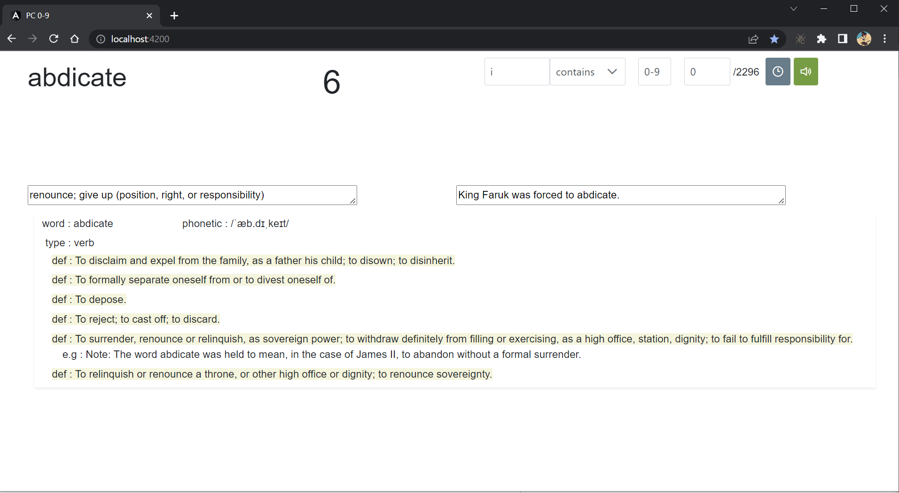
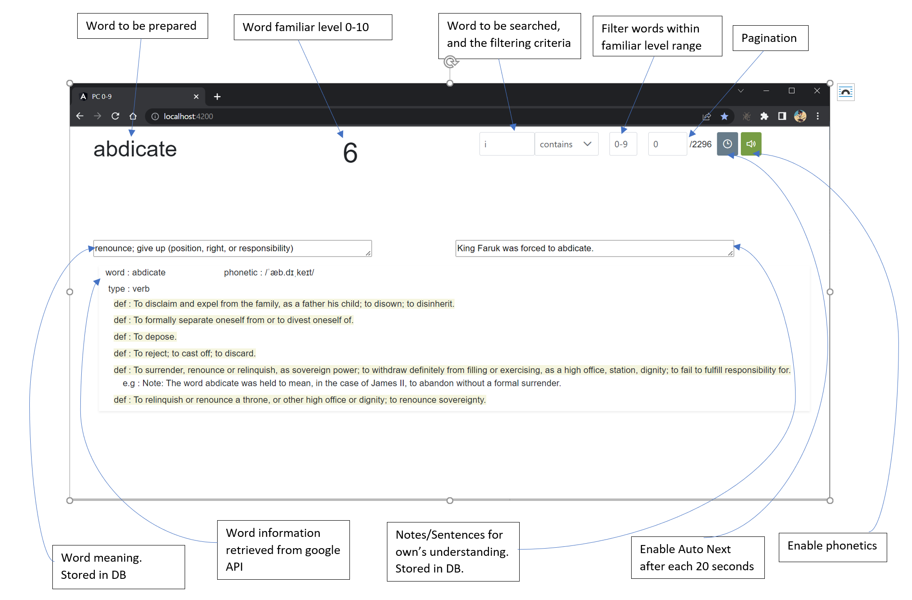
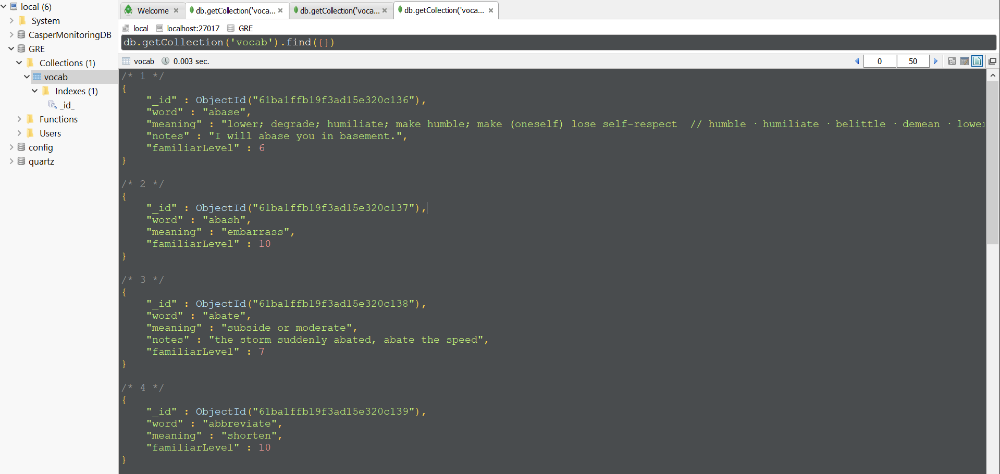

# Vocabulary Front End

Want to learn GRE words effectively and without spending a penny? Then you are at the right place.

This is an Angular App that helped me to learn more than 2000 words

## Setting up the project locally
- Install Java, Spring Boot, Maven, NodeJS, AngularJS and MongoDB
- Populate MongoDB table with JSON template provided [here](https://github.com/amitchakor21/vocabulary/blob/main/db_backup.json).
- Run vocabulary [backend app](https://github.com/amitchakor21/vocabulary) (Spring boot)
- Run vocabulary frontend app (AngularJS)

## Key features
- Users can choose which words to practice based on their past practice.
- You can increase/decrease familiar level as per your practice and next time you will be able to practice them or filter out appropriately
- You can add/edit word meaning and notes
- App is integrated with Google API to see multiple definitions, meanings, and examples.
- You can put this app in Auto Next mode. This way the words will play automatically after every 20 secs.
- You can toggle the phonetics button if you want to listen to pronunciations.

## Main App Window

## App widgets information

## Database sample data

## Keyboard inputs

- Arrow left : go to previous word/page
- Arrow right : go to next word/page
- Arrow up : Increment familiar level of the word
- Arrow down : Decrement familiar level of the word
